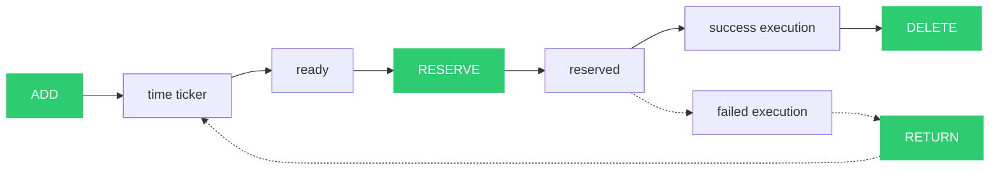
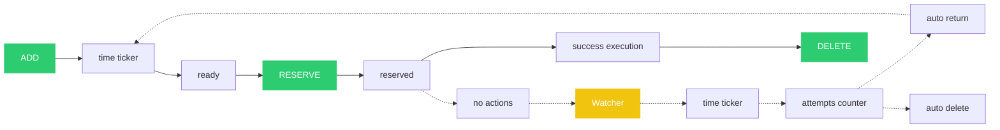

DefferedQ
===========
DefferedQ is a simple and fast work queue.

Protocol
========
Protocol runs over TCP using UTF-8 encoding.

Interface
---------
General command structure:

```
<ATTR_0> <ATTR_1> <ATTR_2> ... <ATTR_N>\n
```

where ATTR_0 is a command, ATTR_1, ..., ATTR_N are command parameters.

Commands
--------

Commands:

1. Add task to queue

```
ADD <DELAY_MS> <TASK_BODY>
```

2. Get and reserve next task from queue

```
RESERVE
``` 

3. Delete reserved task

```
DELETE <TASK_ID>
``` 

4. Return the reserved task back to the queue

```
RETURN <TASK_ID> <DELAY_MS>
``` 

5. Show statistic of service

```
STATS
``` 

Task lifecycle
==============

Typical success lifecycle
-------------------------


Lifecycle with retry
--------------------



Lifecycle of "stuck" task
-------------------------
A stuck task is a reserved task that has not been deleted or returned to the queue. A "Watcher" monitors such tasks.



Copyright
=========
Copyright (c) 2023 Vladimir Lila. See LICENSE for details.
