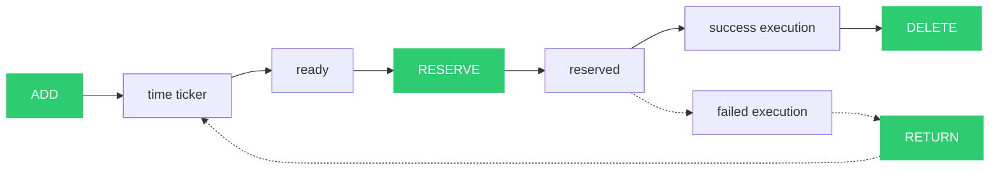
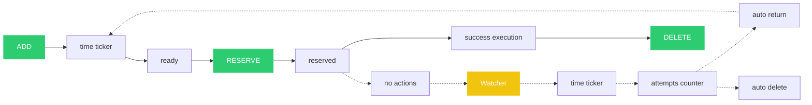

# DefferedQ #
DefferedQ is a simple and fast work queue.

# Protocol #
Protocol runs over TCP using UTF-8 encoding.

## Interface ##
General command structure:

```
<ATTR_0> <ATTR_1> <ATTR_2> ... <ATTR_N>\n
```

where ATTR_0 is a command, ATTR_1, ..., ATTR_N are command parameters.

## Commands ##

1. Add task to queue

```
ADD <DELAY_MS> <TASK_BODY>
```

2. Get and reserve next task from queue

```
RESERVE
``` 

3. Delete reserved task

```
DELETE <TASK_ID>
``` 

4. Return the reserved task back to the queue

```
RETURN <TASK_ID> <DELAY_MS>
``` 

5. Show statistic of service

```
STATS
``` 

## Usage example ##

DefferedQ has the simplest protocol over TCP using UTF-8 encoding, so you can use netcat to work with the server.

```console
pc:~$ nc 172.17.0.1 12000
STATS
TASKS 0 RESERVED 0 CONNECTIONS 1 HEAP 0.24m
ADD 1000 task_1
TASK yqBHNfdgYb DELAY 1000ms
ADD 1000 tast_2
TASK 3TGlYzw4OI DELAY 1000ms
STATS
TASKS 2 RESERVED 0 CONNECTIONS 1 HEAP 0.25m
RESERVE 
TASK yqBHNfdgYb BODY task_1
RESERVE
TASK 3TGlYzw4OI BODY tast_2
RESERVE
nil
STATS
TASKS 0 RESERVED 2 CONNECTIONS 1 HEAP 0.27m
DELETE 3TGlYzw4OI
ok
STATS
TASKS 0 RESERVED 1 CONNECTIONS 1 HEAP 0.27m
DELETE yqBHNfdgYb
ok
STATS
TASKS 0 RESERVED 0 CONNECTIONS 1 HEAP 0.28m
```

# Task lifecycle #

## Typical success lifecycle ##


## Lifecycle with retry ##



## Lifecycle of "stuck" task ##
A stuck task is a reserved task that has not been deleted or returned to the queue. A "Watcher" monitors such tasks.



# Server options #

```console
pc:~$ ./dq --help
DefferedQ is a simple and fast work queue.

Usage of ./deffered-q:
  -debug uint
    	Debug profiler, 1 - enable, 0 - disable
  -h string
    	TCP server host (default "127.0.0.1")
  -ict uint
    	Inactive connection time (in seconds), 0 - without limit
  -p string
    	TCP server port (default "12000")
  -rta uint
    	The number of attempts after which the watcher will delete the reserved task from queue, 0 - watcher delete the reserved task when life time expires
  -rtt uint
    	Reserved task life time (in seconds) after which the watcher will delete the reserved task or add it back to the queue, 0 - disable watcher
```

If you want to use built-in docker, see how to start the server in the Dockerfile with environment parameters:
```dockerfile
ENTRYPOINT /dq/dq \
    -h "" \
    -p 12000 \
    -debug ${DQ_PROFILER_ENABLED} \
    -ict ${DQ_INACTIVE_CONNECTION_TIME_SECONDS} \
    -rtt ${DQ_RESERVED_TASK_STUCK_TIME_SECONDS} \
    -rta ${DQ_RESERVED_TASK_STUCK_MAX_ATTEMPTS} \
    >> /var/log/dq/server.log 2>&1
```

# Copyright #
Copyright (c) 2023 Vladimir Lila. See LICENSE for details.
